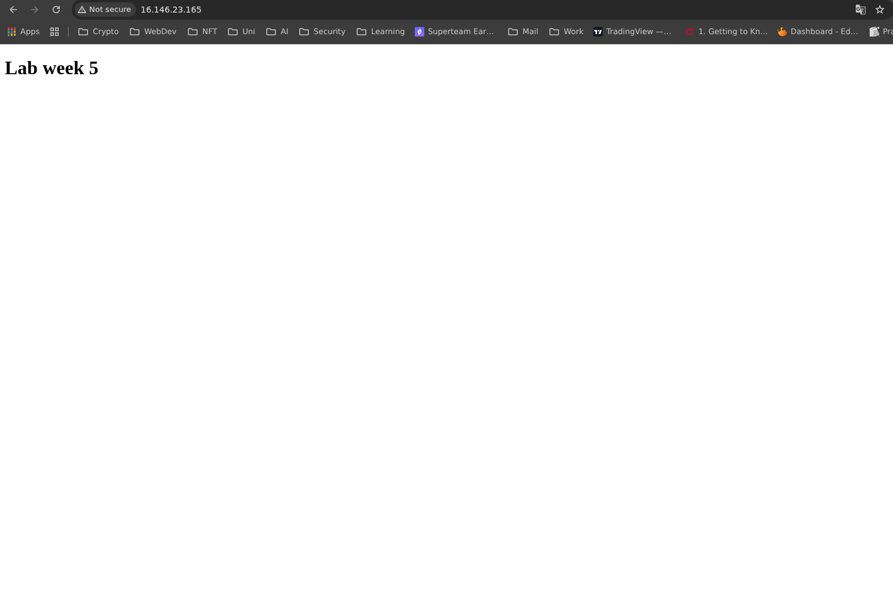

# Week 5 Lab
### Group: Jasmeen Sandhu, Maksym Buhai, Augustin Nguyen
Goal: Use Packer to create an AMI running Debian, with Nginx installed, serving the HTML

### Installing Packer

1. update the system: `sudo apt update && sudo apt upgrade -y`
2. install Packer: `sudo apt install packer`

### Packer Template

1. Clone the Repo: https://gitlab.com/cit_4640/wk5-packer-intro-lab-start
2. Edit the Build Block to define sources:
    
    ```bash
    # https://developer.hashicorp.com/packer/docs/templates/hcl_templates/blocks/build
    build {
      name = "web-nginx"
      sources = [
        # COMPLETE ME Use the source defined above
        "source.amazon-ebs.debian"
      ]
    ```
    
3. Complete the Build Block by adding the inline scripts to create the necessary directories and change directory ownership:
    
    ```bash
    # https://developer.hashicorp.com/packer/docs/templates/hcl_templates/blocks/build/provisioner
      provisioner "shell" {
        inline = [
          "echo creating directories",
          # COMPLETE ME add inline scripts to create necessary directories and change directory ownership.
          # See nginx.conf file for root directory where files will be served.
          # Files need appropriate ownership for default user
          #create the directories
          "sudo mkdir /web/html",
          "sudo mkdir /tmp/web"
          #give ownership of file
          "sudo chown -R admin:admin /web/html",
          "sudo chown -R admin:admin /tmp/web",
          #change permissions
          "sudo chmod -R 755 /web",
        ]
      }
    ```
    
4. Complete the provisioner “file” block to add the HTML file to your image:
    
    ```bash
      provisioner "file" {
        # COMPLETE ME add the HTML file to your image
        source      = "files/index.html"
        # make destination temp 
        destination = "/web/html/index.html"
      }
    ```
    
5. Complete the provisioner “file” block to add the nginx.conf file to your image:
    
    ```bash
      provisioner "file" {
        # COMPLETE ME add the HTML file to your image
        source      = "files/nginx.conf"
        # make destination
        destination = "/tmp/web/nginx.conf"
      }
    ```
    
6. Add provisioner “shell” to run shell script to install nginx:
    
    ```bash
      provisioner "shell" {
    	  #script to run install nginx 
    		script = "scripts/install-nginx"
      }
    ```
    
7. Add provisioner “shell” to run shell script to setup nginx:
    
    ```bash
      provisioner "shell" {
    	  #script to run install nginx 
    		script = "scripts/setup-nginx"
      }
    ```
    
8. Add provisioner “shell” to run inline commands to enable and restart nginx:
    
    ```bash
      provisioner "shell" {
        inline = [
          "sudo nginx -t",
          "sudo systemctl enable nginx",
          "sudo systemctl restart nginx",
        ]
      }
    ```
    
9. Run `packer init .` to initialize and install plugins
10. Run `packer format` to format the pkr.hcl file
11. Run `packer build` to build the image. 
12. Confirm that the AMI was successfully created

### Webpage Image

